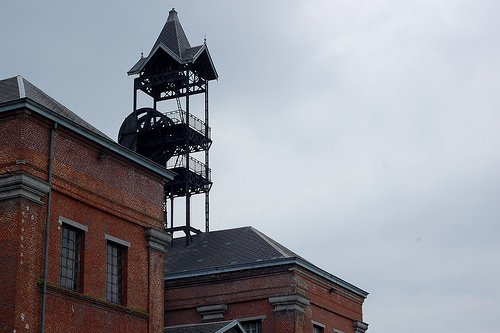
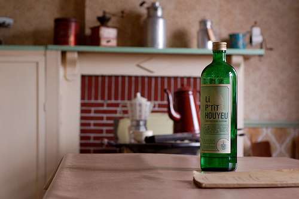
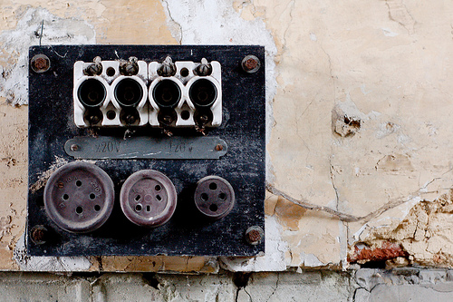

Ce week-end, on a voyagé dans le temps. On a atterri en 1920, en pleine époque minière, quelque part le bassin industriel du Centre.

On a visité [l'Ecomusée du Bois-du-Luc](http://www.ecomuseeboisduluc.be). Il s'agit d'un ancien charbonnage située à Houdeng-Aimeries. Il a fermé ses portes en 1959 et a échappé à la destruction grâce des passionnés d'histoire industrielle. La particularité du site est d'être une cité ouvrière paternaliste avec ses habitations, sa salle des fêtes, son église, son hopital, etc.

<!-- excerpt -->

C'était évidemment l'occasion de faire des photos :

[La suite des photos sur Flickr]( http://www.flickr.com/photos/64k/archives/date-taken/2009/06/06/).

Un lieu étrange, qui fait réfléchir sur les conditions de travail de l'époque. Merci au guide pour la visite vraiment passionnante.
