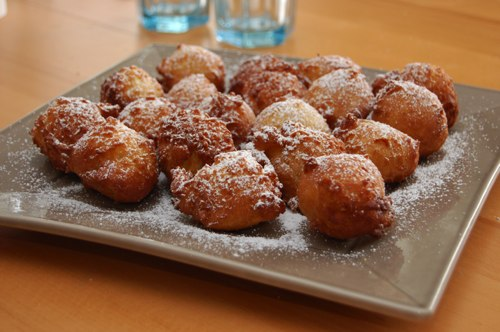

Je ne sais pas vous mais les fêtes de quartiers qui fleurissent à gauche et à droite, la fête de la musique, les petites ducasses et tout ça, moi ça me donne envie de croustillons.

Et comme nous sommes 0% alcool, pas de bière dans les placards, ici. J'entends déjà les puristes du croustillon s'époumonner. Beh oui mais c'est comme ça.

<!-- excerpt -->

Voila la recette facile facile facile:
<ul>
	<li>250 gr de farine</li>
	<li>50 gr de sucre semoule</li>
	<li>30 gr de beurre bien fondu</li>
	<li>1 oeuf</li>
	<li>125 ml de lait dans lequel est dilué un sachet de levure (11 gr en général)</li>
</ul>
On mélange tout ça dans l'ordre (donc d'abord la farine, puis le sucre, puis le beurre, etc.). On pétrit à la cuiller en bois jusqu'à l'obtention d'une pâte homogène et élastique. Ca va assez vite.

On laisse reposer une demi-heure à température ambiante, à l'abri des courants d'air (avec un essuie dessus, ça aide), ça va lever un peu.

On fait chauffer l'huile de friture à 190°, on s'arme de deux cuillers à soupe, l'une pour prendre la pâte et l'autre pour la faire glisser dans l'huile. Quelques minutes de cuisson (il faut retourner à mi-cuisson pour que ce soit bien cuit des deux côtés), et quand la petite boule est joliment dorée, on la dépose sur de l'essuie-tout.

Quand les croustillons sont égouttés et un peu refroidis, on saupoudre de sucre impalpable.

Bon, on peut pousser le vice jusqu'à faire des cornets en papier, ok.

Rien à voir mais Elliott fait du 4 pattes depuis aujourd'hui youhouuuuuuu :D
