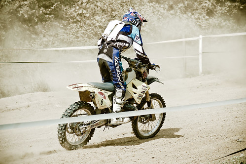

Ce week-end à Franchimont, ce sera la 30ème et peut-être dernière édition des [12 heures de la Chinelle](http://www.12heuresdelachinelle.be). Pour ceux qui ne connaissent pas, il s'agit d'une classique de l'endurance de moto tout-terrain créée en 1980 par [Joël Robert](http://fr.wikipedia.org/wiki/Jo%C3%ABl_Robert), notre sextuple champion du monde de motocross. Mais là il a juré que ce serait la dernière fois qu'il l'organise, comme il ne se fait plus tout jeune. Il espère trouver une équipe pour le remplacer.

La Chinelle, c'est une ambiance spéciale. Je pense que j'ai dû y aller la première fois vers 1984 quand j'avais 6 ans. Un mélange de poussière, d'éclairage dans la nuit, de hot-dogs et de bruits de moto. Ou quand on y était allé Soph et moi et qu'il y avait 20 cm de boue. Le départ est donné au coup de fusil, le samedi à minuit. Et l'arrivée se fait le lendemain. L'engouement est tel cette année, que 105 équipages seront au départ, ce qui nous fera plus de 300 pilotes.

<!-- excerpt -->

Départ samedi 8 août à minuit à Franchimont, près de Philippeville. Entrée gratuite. 25 000 spectateurs. Ca vous changera de vos Apéros Urbains et autres Twunch ;)

Plus d'infos sur [le site officiel](http://www.12heuresdelachinelle.be).
