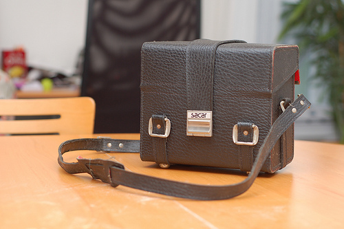
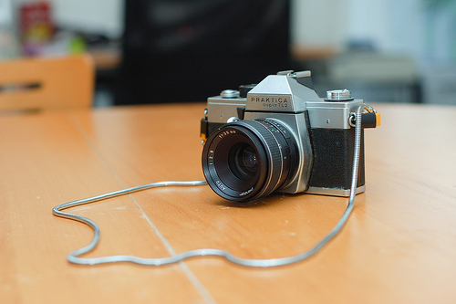
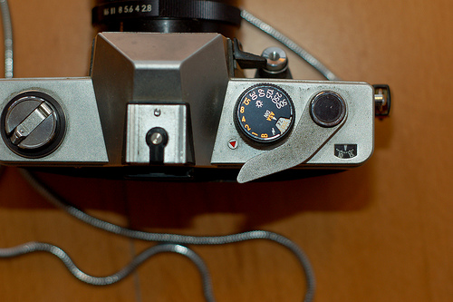

Petit tour dans les vieilleries chez ma mère, en expédition-minerve (j'ai maaaaaaaal :'(  ) .

Nous sommes revenus avec la collection "Encyclopédie de la Photo", par Kodak, datant de la fin des années 70 et une grosse boîte que je connais bien, qui contient l'appareil photo de mon père. Mon père étant décédé il y a presque 14 ans, cela fait depuis tout ce temps que l'appareil n'a plus servi. Peut-être même davantage car je n'ai plus aucun souvenir de l'appareil qui prenait les photos de famille, quand j'étais plus jeune. Celui-là? Un appareil plus récent et moins "pro" ? Aucune idée!

L'appareil en question est un Praktica Super TL2. Produit entre 1975 et 1978.  La boîte contient aussi un flash Metz Mecablitz 223 L23BC, des filtres; un rouge et un jaune et des objectifs: Aus Jena DDR 2.8/50mm, Pentor Auto 2.8/50mm et un Pentor Auto 2.8/35mm.

Bon, c'est du vieux matériel. J'ai la garantie sous les yeux. Expirée (beh tiens), l'appareil a été acheté au GB de Charleroi le 6 juin 1978. Je ne savais même pas qu'il y avait un GB à Charleroi. Sous l'Inno, non? C'est super flou dans ma tête.

Ca me fait tout drôle. C'est con mais je suis vachement émue.

<!-- excerpt -->

Là où la dimension "trésor" prend tout son sens c'est qu'il y a un film dedans, entamé jusqu'à la 12ème photo.

Nous allons terminer ce vieux film et le faire développer. La même pellicule contiendra des photos datant d'il y a longtemps, p-e des photos de moi ou de mon frère lorsque nous étions enfants, des photos de famille, de gens maintenant disparus, et des photos d'aujourd'hui, à l'âge adulte, des photos d'Elliott. Ca me fait bizarre, ce voyage dans le temps!

Affaire à suivre...

(Ah oui et vous aurez bientôt l'immense honneur de faire connaissance avec mon nouveau meilleur ami)
