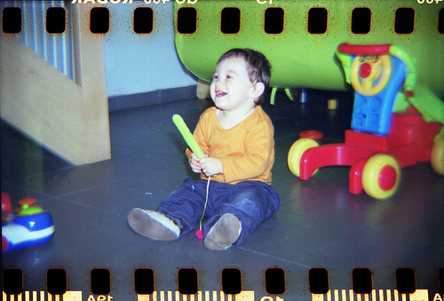
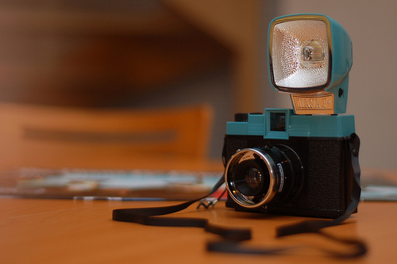
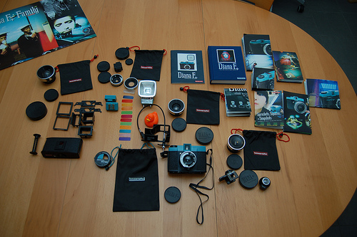

On a bien reçu le scanner, le CanoScan 8800F (tadaaaaam). Ca a été un peu la joie en la demeure pour le faire fonctionner mais là ça va. Donc on attend d'avoir un petit chiffon antistatique Ilford parce que la moindre poussière est numérisée et si vous ne le saviez pas encore, Ced est assez maniaque là dessus.

Voila un négatif scanné avec l'ancien scanner, en attendant le chiffon.

Ca fait délicieusement années 70, j'adore! Bon les jouets autour font un peu moins années 70, ok. Ca me dirait bien de faire plutôt des photos un peu urbaines. Et du NB aussi, ça me botterait bien.

<!-- excerpt -->

Avec le chiffon, furent commandé le révélateur (Ilford LC29), le fixateur (Ilford Rapid Fixer), la  cuve de développement (Paterson Super System 4) et les films noir et blanc (Ilford HP5). On aimerait développer les négatifs nous-même. Et puisque le grenier de ma mère cache quelque part un agrandisseur, on tirera p-e les photos un de ces quatre. Pffff faudrait faire de la place à l'étage. Mais pourquoi les journées ne font pas 48h, pourquoi?!?

On a entamé le film 120 dans le Diana mais comme on ne peut pas photographier _qu'Elliott et des petites fleurs_ (c'est pas moi qui le dit hein), on attend d'autres occasions. Bientôt je ferai un billet sur mon Diana chéri mais je voudrais avoir fini le film, reçu le chiffon et scanné les négatifs pour bien illustrer et faire le beau billet qu'il mérite.

Et puis pour revenir aux sources (pour moi, la source c'est le numérique, beh oui) , j'ai reçu un super cadeau (oui encore un) pour mon anniversaireuuuuh et c'est un super grand angle et je suis heureuuuuuuuse :D Le Tokina 11-16 mm. On commence à avoir un beau petit panel de matériel mine de rien. De 11 à 300 mm en 5 objectifs :D Je pensais qu'on irait faire de jolies photos à Bruxelles samedi passé mais finalement, on avait du bois à ranger. Hum

Allez quelques photos de mon Diana chéri en attendant, reçu par des amis il y a quelques semaines (merciiiiiiiiiii)

