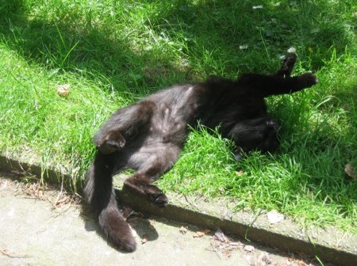

Une amie doit se séparer de son chat car son fiston, de l'âge d'Elliott est hyper hyper allergique.

Bidouille est une femelle et a 6 ans et finira sa vie à Veeweyde ou dans un autre refuge si elle ne trouve pas de nouveau propriétaire assez vite :(

<!-- excerpt -->

Et dans les refuges... enfin un animal de 6 ans n'a pas beaucoup de chance en général...

J'en ai parlé sur facebook, twitter et maintenant ici. Franchement si je pouvais, j'accueillerais la bestiole (surtout qu'elle chasse les souris et que hum... Félix se contente de garder les 4 fers en l'air et de regarder le plafond)

Voila une photo du monstre ^^

