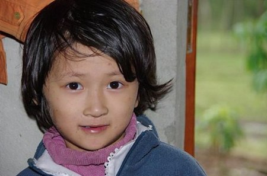
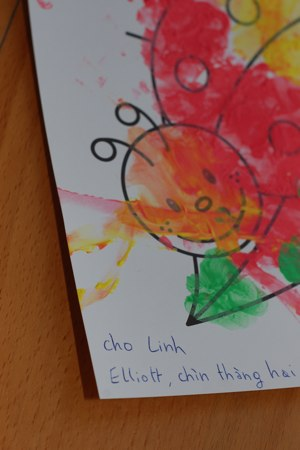

Linh est vietnamienne et a 6 ans. Elle habite à 70 km d'Hué. Sa maman est décédée à sa naissance et son père un an plus tard. Ils avaient tous les deux le sida. Linh aussi est atteinte par le virus. A cause de ça, elle a été isolée jusqu'à ses 6 ans, l'école maternelle ne voulait pas d'elle. Actuellement, elle vit avec sa grand mère et est récemment entrée à l'école primaire. Ca lui permet de ne plus être aussi isolée.

<!-- excerpt -->

Depuis peu, Linh est ma filleule grâce à l'association des Sampaniers du Vietnam. L'association se concentre dans un premier temps à aider ces hommes et ces femmes qui passent de longues journées à draguer du sable et du gravier sur la Rivière des Parfums. Les parrainages et les différents dons permettent en ce moment d'offrir la scolarité aux enfants, de construire des maisons... des dons de nourriture sont également organisés, la construction d'une école maternelle,  rendre possible l'opération à coeur ouvert d'un bébé ou l'opération aux yeux de jeunes enfants atteints de strabisme, la scolarité d'une enfant du sida, etc.

Le parrainage nous coute 10 euros par mois. Rien, donc. Mais ce "rien" va permettre à Linh de continuer sa scolarité, manger à sa faim et prendre des forces pour pouvoir bénéficier d'un traitement médicamenteux. Je suis déjà attachée à cette petite et j'ai hâte qu'elle reçoive ma lettre, qu'elle sache qu'on pense à elle à l'autre bout du monde, qu'elle ait le sourire grâce aux colis que je lui enverrai.... j'ai hâte de recevoir un dessin et les premiers mots qu'elle aura appris à écrire à l'école. J'ai hâte qu'Elliott la connaisse et soit sensibilisé à d'autres cultures que la notre, j'ai envie qu'il ait envie de connaitre le monde.

Voila, ce n'est pas un appel à la pitié ni aux dons, ni aux parrainnages (n'empêche, foncez! ;)  ) C'est juste que je ne voulais pas rester sans diffuser l'information. Pourquoi cette association et pas une autre? Pourquoi aider les Sampaniers et pas d'autres personnes? Et pourquoi pas? Je ne peux pas aider tout le monde, j'ai dû faire un choix. Cette association m'a plu par sa facilité de contact et de démarches. Il y a deux personnes de référence, facilement joignables, d'une sympathie et d'une patience incroyables. Un document à imprimer, remplir et renvoyer, un chèque à faire pour les français, un virement pour les belges. L'argent donné va directement à l'enfant choisi, et pas dans un pot commun qui servira à différents projets (c'est avec ça que j'ai du mal dans les autres associations). On peut correspondre avec son ou sa filleule, les lettres sont traduites en vietnamien par Thuy, la responsable sur place (non je n'ai pas écrit toute ma lettre en vietnamien). Thuy se charge aussi de donner fréquemment des nouvelles des filleuls et de leurs résultats scolaires...

Plus d'infos sur [le site des Sampaniers du Vietnam](http://lessampaniersduvietnam.over-blog.org/)
