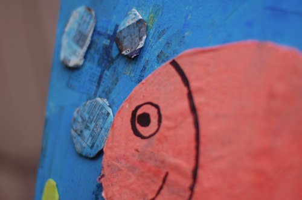
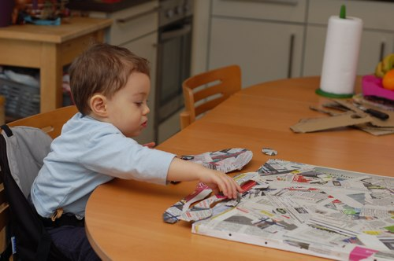
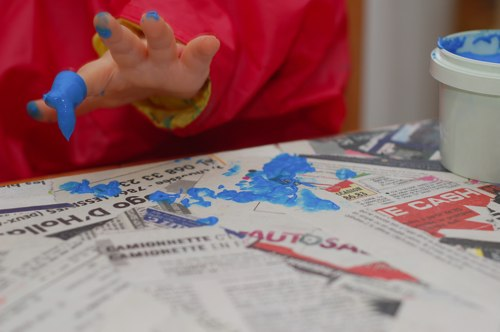
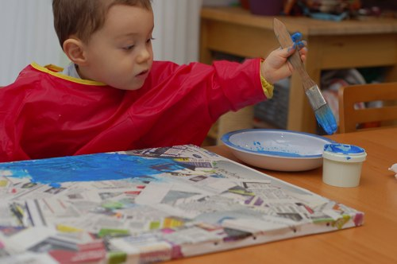

**Matériel nécessaire:**

- [les éléments secs recouverts de papier journal](http://64k.be/2010/02/23/activite-a-partir-de-18-mois-un-tableau-en-journal/)
- de la gouache
- une assiette en plastique (pour faire les mélanges ou liquéfier un peu la peinture)
- un gros pinceau
- un gros feutre indélébile
- du collant double face ou de la super-bonne-colle-qui-colle-vraiment-pour-du-vrai (lisez: la glue universelle comme j'ai ici n'a pas fonctionné)
- un clou et un marteau
- les ptits doigts de [l'autre fois](http://64k.be/2010/02/23/activite-a-partir-de-18-mois-un-tableau-en-journal/) (et le ptit bonhomme qui va avec)

Première partie [ici](http://64k.be/2010/02/23/activite-a-partir-de-18-mois-un-tableau-en-journal/)

Montrez les éléments séchés au ptit mec et apprenez-lui à dire "Whaaaaaaah c'est bôôôôô" ou "bravoooooo maman" avec des yeux écarquillés (mais c'était juste pour l'égo, rappelez-lui que c'est lui qui a tout fait, avec un bisou sur le front, évidemment)

Peignez avec lui les différents éléments. Ici nous n'avions que 4 couleurs, donc on a un peu joué sur la quantité d'eau et sur les mélanges pour avoir différentes teintes.

Avec un pinceau, ça ira mieux, loulou.

Laissez séchez.

Quand c'est sec, apportez quelques détails, ici on a ajouté un peu de jaune pour faire le sable (pour l'occasion, la petite main a laissé la grande main la maintenir pour faire les ploutch-ploutch-ploutch), et des détails sur le poisson. Re-laissez sécher.

Quand tout est bien sec, y compris les ploutch-ploutch-ploutch, laissez le bonhomme jouer avec les différents éléments, donnez-leur un nom, spécifiez les couleurs, racontez l'histoire du poisson qui fait des bulles et se chatouille le ventre entre les algues... disposez-les avec lui sur le fond bleu, laissez-le faire un peu...

Puis armez-vous de patience et de glue universelle OU tout simplement de collant double face et installez les éléments en bonne place. Puis au mur, ~~en plein milieu du salon~~ dans la chambre du petit chou-chéri. Tadaaaaaam :)

