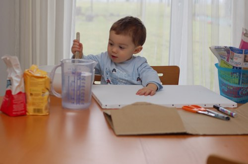
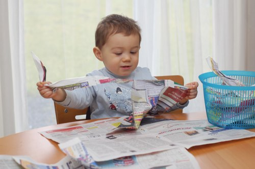
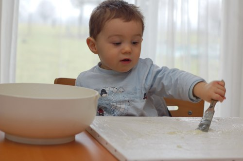
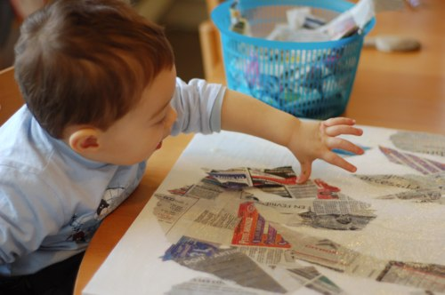
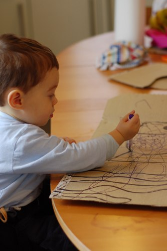
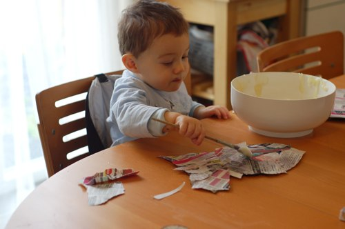
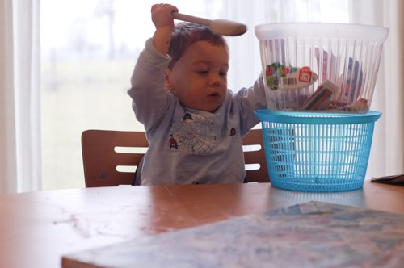
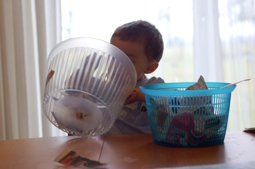
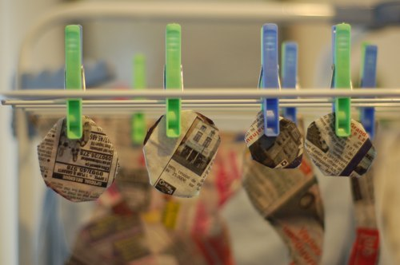

### Matériel nécessaire:

#### Pour la colle 100% + comestible que la colle à tapisser chimique:
- un demi litre d'eau
- un petit verre de farine
- la moitié d'un petit verre de sel
- une casserole
- un saladier

#### Le reste:
- une toile
- du carton épais
- du papier journal
- deux saladiers (ici, les deux parties d'une essoreuse à salade)
- un feutre lavable
- un gros marqueur
- une paire de ciseaux
- un gros pinceau
- un p'tit mec curieux plein de doigts (fonctionne également avec une p'tite mamzelle mais je n'en n'ai pas encore sous la main)

Commencez par préparer vous-même [la colle](http://www.espritcabane.com/bricolage-bio/colle-bio.php) : faire chauffer l'eau dans la casserole, y verser le sel et ensuite petit à petit la farine en remuant au fouet le plus vite possible pour éviter les grumeaux. C'est également possible de faire tout ça à froid, dans un mixeur et puis faire chauffer. La colle est prête lorsqu'elle a la texture d'une béchamelle un peu épaisse. Mettez-la dans un saladier en plastique et laissez la refroidir.

Pendant que la colle refroidit, mettez à contribution les 36000 petits doigts pour déchirer de la façon la plus barbare possible les quelques feuilles de papier journal. Dites au p'tit bonhomme de mettre les morceaux de papier journal dans un saladier.

Montrez ensuite au ptit bonhomme comment encoller la toile et laissez-lui le pinceau entre les doigts. Qu'il se débrouille un peu, zut à la fin!!!

Participez un peu quand même sinon on est encore là demain.

Une fois que la toile est recouverte de colle, montrez au ptit bonhomme comment prendre un seul morceau de papier et le mettre délicatement sur la colle. Tout ça sans faire ploutch-ploutch-berk et se retrouver avec des gouttes de colle partout sur le visage et les cheveux (nouvellement coupés, comme il est bôôôôôôô mon bonhomme chériiiii <3 <3 ) mais également sur la table, le sol, le plateau de fruits, les chaises, et tout ce qui se trouve dans un rayon de 3m autour du ~monstrueux~ ptit bonhomme.

Quand la toile est recouverte de morceaux de papier journal, laissez bonhomme faire une pause (il va bien sûr jouer avec une cuiller en bois, les morceaux de papier et un saladier ou deux, PAS avec la colle ni le pinceau. Bien sûr) et finissez convenablement les bords de la toile, encollez également par dessus les morceaux de papier journal puis remettez le petit fou sur sa chaise et c'est repartiiii

Prenez un grand morceau de carton et dessinez les différents éléments. Ici, on a fait un poisson, des bulles et des algues. Laissez un feutre aux petits doigts sinon c'est-pas-du-jeu-d'abord!

Découpez les éléments...

Et c'est reparti pour une séance d'encollage et de déposage (quoi?) de papier journal.

Laissez de nouveau le petit curieux découvrir (il a tenu une heure!!!!!!) une foule de choses avec ce qu'il reste de bouts de papier, deux saladiers et une cuiller en bois (et dire qu'on se ruine à leur acheter des jouets..)

... et finissez convenablement les bords des éléments en carton (sinon le poisson va ressembler à une fricassée mouhahaha qu'elle est bonne c'te feinte, comme je me marre)... Puis laissez sécher.

Suite et fin [ici](http://64k.be/2010/02/23/activite-a-partir-de-18-mois-un-tableau-en-journal-suite-et-fin/)
