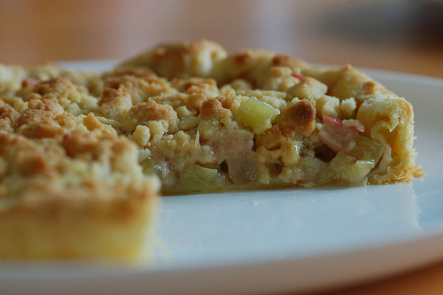
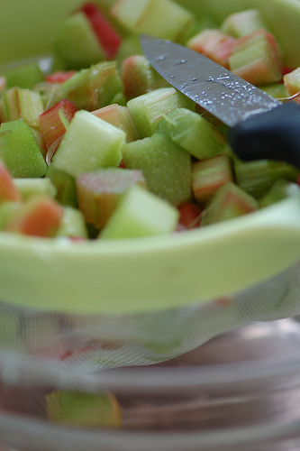

En perpétuelle recherche de LA recette de la tarte à la rhubarbe, j'avais déjà fait quelques essais, moyennement concluants, mélangeant la pauvre rhubarbe à des fraises, de l'oeuf, du moitié-clafoutis-moitié-crème, à grand renfort de sucre, cassonade, épices, et puis et puis et puis bof finalement.

Et puis je me suis dit, ma vieille, tu veux une tarte à la rhubarbe. Fais une tarte à la rhubarbe. Pas à la rhubarbe + machin-truc-bidule. De la rhubarbe, de la rhubarbe, de la rhubarbe, bordel!

<!-- excerpt -->

Bref, cette recette-ci est anti-prise de tête: De la pâte, de la rhubarbe et du crumble pour adoucir quand même un peu parce que la rhubarbe de mon jardin, elle douille!

Et pas de pré-cuisson, parce que zut hein. On est en mode flemmard oui ou non???

La recette a été testée et approuvée et franchement...... Franchement, elle est indécente. Miam.

Maestro, **les ingrédients**, s'il vous plait:
<ul>
	<li>600 gr de rhubarbe bien fraîche</li>
	<li>du sucre semoule extra fin</li>
	<li>de la pâte brisée ou feuilletée, selon les gouts. Pas de pâte sablée, parce qu'il faut la pré-cuire à blanc</li>
	<li>100 gr de farine</li>
	<li>70 gr de beurre</li>
	<li>70 gr de cassonade blonde.</li>
</ul>
Peler **la rhubarbe**, la couper en petits tronçons d'1cm, les enduire de sucre semoule et laisser égoutter pendant une petite heure. Dans une passoire, très important. Elle va perdre beaucoup d'eau, ça évite qu'elle perde l'eau pendant la cuisson et que le fond de tarte soit trop mou une fois cuit.

Déposer **la pâte** dans le moule à tarte, la piquer avec une fourchette sans la transpercer.

Préchauffer **le four** à 180°

Préparer **le crumble**: couper le beurre en petits morceaux (pas de beurre fondu!), écraser le beurre entre les doigts en le mélangeant en même temps à la farine et à la cassonade. La pâte à crumble est parfaite quand elle s'amalgame quand on la serre dans la main, puis s'effrite.

Déposer la rhubarbe dans le fond de tarte, saupoudrer de crumble, et hop 30 à 35 minutes au four.

Tout ça pour me faire pardonner de moins bloguer.....

Bon appétit, au fait!
