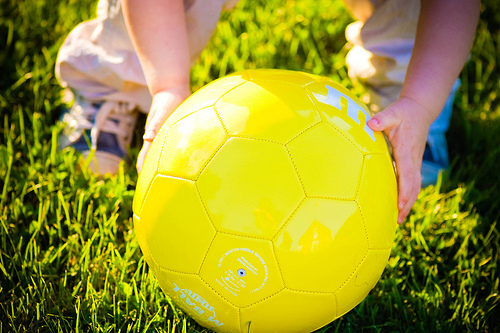
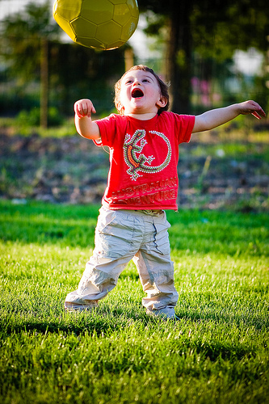

Elliott a reçu un chouette cadeau aujourd'hui!! C'est une M-Ball, une balle toute folle qui fond dans la bouche, pas dans la main. Sur une initiative de M&amp;M's, 14 exemplaires de ces ballons incontrôlables ont été signés par des personnalités  de la télévision, de la musique et du sport comme le groupe Das Pop, Kim Geveart ou encore les équipes complètes du Standard et d'Anderlecht. Ils sont actuellement [vendus sur eBay](http://myworld.befr.ebay.be/mmsbelgium) . Les bénéfices  seront destinés à un projet éducatif à Kinshasa ainsi qu'à l'ONG [SOS Villages d'Enfants](http://www.sos-villages-enfants.be/Pages/default.aspx).

Elliott adore!

<!-- excerpt -->

<object style="height: 344px; width: 425px;" classid="clsid:d27cdb6e-ae6d-11cf-96b8-444553540000" width="100" height="100" codebase="http://download.macromedia.com/pub/shockwave/cabs/flash/swflash.cab#version=6,0,40,0"><param name="allowFullScreen" value="true" /><param name="allowScriptAccess" value="always" /><param name="src" value="http://www.youtube.com/v/77g5H7vUj1E" /><param name="allowfullscreen" value="true" /><embed style="height: 344px; width: 425px;" type="application/x-shockwave-flash" width="100" height="100" src="http://www.youtube.com/v/77g5H7vUj1E" allowscriptaccess="always" allowfullscreen="true"></embed></object>
