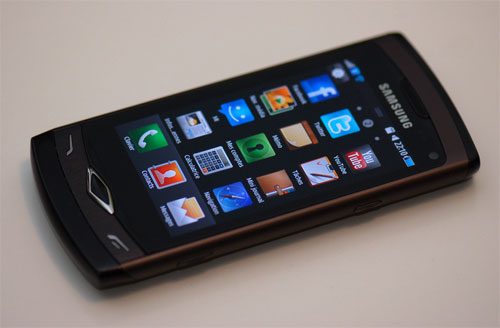
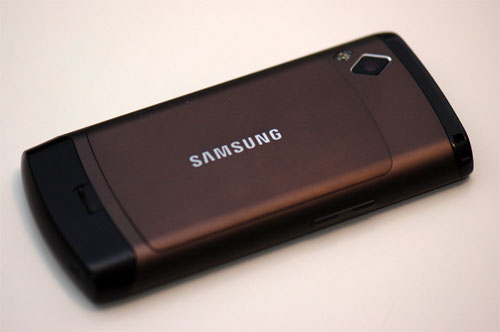
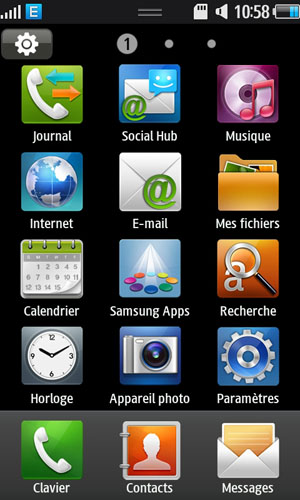
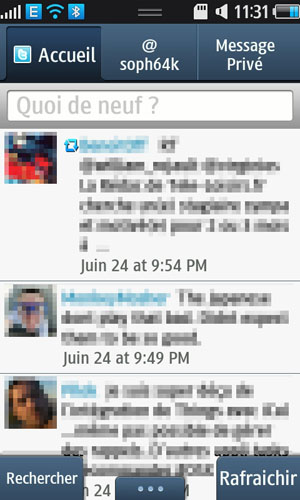
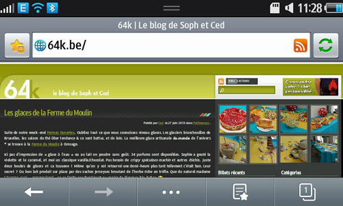
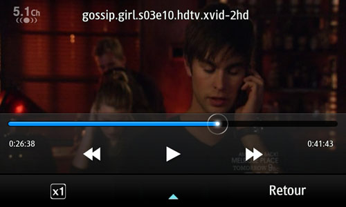
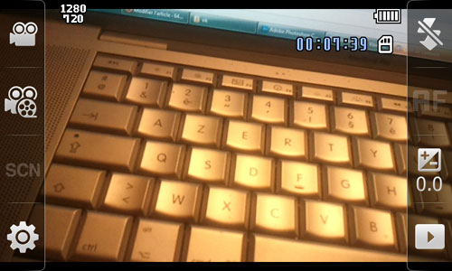
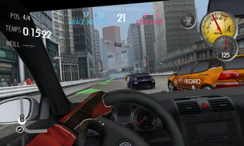
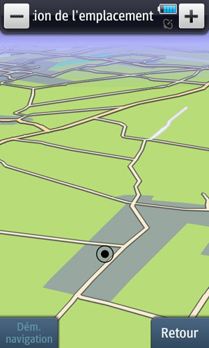

Deux mois déjà que nous avons reçu le [Samsung Wave](http://64k.be/2010/06/22/samsung-wave-s8500/). Il est temps de faire de vous faire part de nos impressions après un essai prolongé. Pour la petite histoire, il est devenu le GSM officiel de Soph :)

<!-- excerpt -->

Par rappel, le Wave se positionne comme un concurrent à l'iPhone et des smartphones Android. Il est le premier à inaugurer [Bada](http://www.bada.com/), le nouvel OS de Samsung. Sur le papier, il n'a rien à envier à l'iPhone 4 :
<ul>
	<li>Processeur ARM Cortex A8 1 Ghz</li>
	<li>512 Mb de RAM</li>
	<li>Processeur 3D PowerVR SGX 3D</li>
	<li>Ecran multitouch de 3.3" 800x480 Super AMOLED</li>
	<li>Wifi N, Bluetooth 3.0 et 3G</li>
	<li>Appareil photo autofocus 5 mégapixels avec flash LED</li>
	<li>Caméra HD 720p</li>
	<li>Slot microSD(HC) jusque 32 Go</li>
	<li>Accéléromètre</li>
	<li>Déctecteur de proximité</li>
	<li>Prise jack 3,5 mm</li>
</ul>
<h3>Le design extérieur</h3>
Le design du Wave reste assez classique. Mais la qualité de l'écran Super AMOLED ne passe pas inaperçue. C'est bien simple, à ce jour aucun téléphone n'arrive à avoir un rendu aussi parfait. L'écran reste lumineux, lisible et contrasté en toute situation.

Trois touches permettent respectivement de gérer le volume, le verrouillage et de prendre des photos. La connectique est standard avec une prise micro USB et une prise jack stéréo 3,5 mm. Cela évite de devoir acheter des câbles propriétaires.

Le dos du téléphone est en métal. Derrière le capot se cache la batterie qu'il faudra enlever pour accèder à la carte SIM et la carte micro SD, pas toujours pratique.

<h3>Le système d'exploitation</h3>
Le Samsung Wave est le premier téléphone de Samsung à bénéficier du nouvel OS appelé Bada. Mais surtout le premier à disposer de son kiosque d'applications maison, le [Samsung Apps](http://www.samsungapps.com/). Samsung est en train de le promouvoir via un [concours ](http://developer.bada.com/challenge/index.do)destiné aux développeurs avec 100 000 euros à la clé. Mais force est de constater qu'à ce jour, l'offre est encore très réduite. Les applications font plutôt office de gadgets que de programmes réellement utiles.

Au niveau téléphonie classique, il n'y rien de spécial à signaler, la qualité du son et de la réception sont bonnes.
<h3>L'interface</h3>
Ce n'est pas compliqué. Samsung a copié ce qui fait de mieux en ce  moment, à savoir l'iPhone. La présentation des icônes, la façon de les  faire défiler, le client mail, etc, tout ressemble à l'interface Apple.

Les widgets eux sont inspirés d'Android. Ils fonctionnent assez bien  mais il n'y a pas moyen de les sauver. En effet si on ferme  l'application Widgets, ils disparaissent tous et il faudra les  sélectionner à nouveau la prochaine fois. Ce sera peut-être corrigé dans  une future mise à jour de l'OS.

Le multitâche est très bien géré. On peut lancer plusieurs  applications en même temps sans problème. Voire même passer d'un jeu 3D  au navigateur web sans le Wave ne bronche, tout reste très fluide. Si on  garde le doigt enfoncé sur le bouton Home, une sorte de dock apparait  avec les différentes applications ouvertes.
<h3>Les applications intégrées</h3>
Le Wave est fourni avec plusieurs applications dédiées aux réseaux sociaux. Les applications Facebook et Twitter sont très agréables à utiliser. Pour chaque contact, en plus du n° de téléphone, on peut également définir les comptes Twitter, Facebook, etc. L'envoi des photos vers Flickr ou configuration un compte Gmail sont également très simples. L'application Mini journal  permet de tenir un petit carnet de note original, agrémenté de photos, idéal pour les vacances. Le client de messagerie instantanée Palringo est installé, par contre le protocole MSN n'est pas présent !

<h3>Le navigateur Web</h3>
Comme tout smartphone, le Wave dispose d'un navigateur Web. Il s'agit de Dolphin 2.0 basé sur Webkit. Le support de Flash est disponible mais il ne s'agit pas de la dernière version. Avec la rotation automatique de l'écran est le zoom multipoint, la navigation s'avère plutôt réussie. On notera juste que le reformatage du texte pour le rendre plus lisible n'est pas toujours efficace.

<h3>La vidéo</h3>
C'est le point fort du Samsung Wave. Il faut dire que son magnifique écran y est pour beaucoup. Le lecteur vidéo est très bien conçu. Il supporte les fichiers divx, les sous-titres et même les vidéos MKV 720P. Oui vous avez bien lu. Là où certain ordinateur ont du mal à lire des flux hd, le Wave lit du 720p avec une fluidité déconcertante. Evidemment l'écran n'atteint pas cette résolution, mais cela évite de devoir convertir les vidéos dans un format propriétaire comme avec l'iPhone.

La partie enregistrement n'est pas en reste, puisqu'il est également possible de filmer en 720p. Oublier tout ce que vous avez vu en terme de vidéos filmées avec un téléphone. La qualité des vidéos du Wave est comparable à celle des Flip MinoHD et autres Creative Vado HD.

Petite vidéo maison :

<object classid="clsid:d27cdb6e-ae6d-11cf-96b8-444553540000" width="560" height="340" codebase="http://download.macromedia.com/pub/shockwave/cabs/flash/swflash.cab#version=6,0,40,0"><param name="allowFullScreen" value="true" /><param name="allowscriptaccess" value="always" /><param name="src" value="http://www.youtube.com/v/AKj-fln**ZE&amp;hl=fr_FR&amp;fs=1?rel=0&amp;color1=0x234900&amp;color2=0x4e9e00" /><param name="allowfullscreen" value="true" /><embed type="application/x-shockwave-flash" width="560" height="340" src="http://www.youtube.com/v/AKj-fln**ZE&amp;hl=fr_FR&amp;fs=1?rel=0&amp;color1=0x234900&amp;color2=0x4e9e00" allowscriptaccess="always" allowfullscreen="true"></embed></object>
<h3>La synchronisation</h3>
Le Wave se synchronise avec Samsung Kies, un programme hélas disponible uniquement pour Windows. Il s'agit d'une usine à gaz d'un autre âge, loin de rendre la synchronisation intuitive. Kies sert également à mettre à jour le firmware. Lors d'une mise à jour, le notre a planté, rendant le téléphone inutilisable et nous obligeant à faire un reset complet pour remettre le firmware.
<h3>Les jeux</h3>
J'ai testé Need for Speed : Shift et Asphalt 5. Le Wave s'en sort très bien au niveau de l'affichage 3D, on est un cran au dessus de la PSP. Evidemment, ça reste un téléphone avec une ergonomie pas vraiment conçue pour le jeu, mais il y a du potentiel.

**Le GPS**

Le programme de navigation Route 66 est fourni, mais sans le calcul d'itinéraire, qu'il faut acheter en plus. Nos quelques tests ont montré que le programme est assez lent à trouver la position GPS. Pourtant dans les options de localisation la position est affichée très rapidement. Espérons que ce sera  corrigé via une mise à jour pour tirer tout le potentiel de la puce aGPS et que les ténors de la catégorie tel que Tomtom se pencheront sur le Wave.

<h3>L'autonomie</h3>
En utilisation normale le Wave tient plusieurs jours. Mais dès qu'on commence à faire beaucoup de vidés, qu'on surfe sur le web, etc, il ne faut pas espérer tenir plus d'une journée. Comme la plupart des smartphones actuels.
<h3>Conclusion</h3>
Le Wave est un très bon smartphone. Au niveau hardware il joue sans problème dans la cour de l'iPhone et des téléphones Android. Les programmes créés par Samsung prouvent que la partie software n'est pas en reste. Maintenant le gros point d'interrogation reste Bada et le Samsung Apps. Les développeurs vont-ils suivre et créer ou porter leurs applications sur Bada ? Vu les parts de marchés de Samsung dans la téléphonie mobile, si ce dernier convertit ses futurs téléphones à Bada, on devrait voir de plus en plus d'applications.

Ah oui j'oubliais un des gros avantages du Samsung Wave par rapport à la concurrence : on peut le trouver à 300 euros !

Note : on n'a pas encore d'abonnement 3G, donc ce point n'a pas été testé.
<h3>Quelques liens utiles :</h3>
<ul>
	<li>[La page dédié sur le forum hardware.fr](http://forum.hardware.fr/hfr/gsmgpspda/smartphone/topic-unique-samsung-sujet_21066_1.htm)</li>
	<li>[Un forum sur le Wave](http://samsung-wave.forumactif.net/forum.htm)</li>
	<li>[Badaworld](http://www.badaworld.fr/)</li>
</ul>
