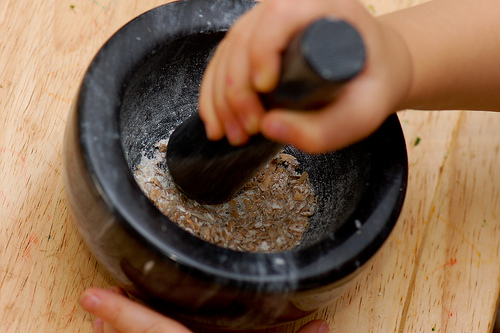
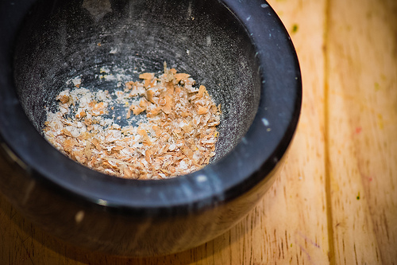
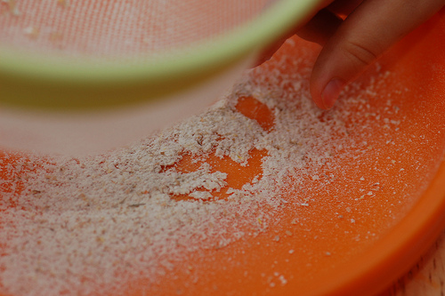
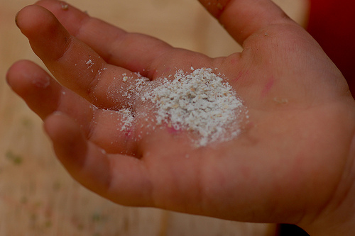

Quel plaisir, la fin de l'été, pour un petit bonhomme qui adore les tracteurs!

Alors, au détour d'une promenade, on observe longuement les machines qui coupent le blé, séparent la paille du grain, font les ballots, ramassent les ballots, les déposent sur une grande remorque... On dit le nom de ces grosses machines et on a des fous-rire en essayant de répéter "mois-son-neuse-bat-teuse". A 2 ans, ça fait beaucoup de syllabes, même quand on papote déjà comme un chef!

<!-- excerpt -->

Puis on est impressionné quand la fameuse moissonneuse-batteuse passe tout près. Parce qu'à 2 ans, on est grand mais on est quand même encore un peu petit.

Puis on explique , pour la énième fois,  que le blé va servir à faire de la farine, qui servira, elle, à faire du pain, des gâteaux, des biscuits, des pâtes... Et comme c'est abstrait tout ça, on ramasse quelques épis de blé et on se dépêche de rentrer à la maison pour les écraser dans le mortier, les secouer dans la passoire et voir et goûter la farine tout douce qui apparait comme par magie.

Demain, on ajoutera ces quelques grammes de farine dans la machine à pain. Et le pain sera encore meilleur!

