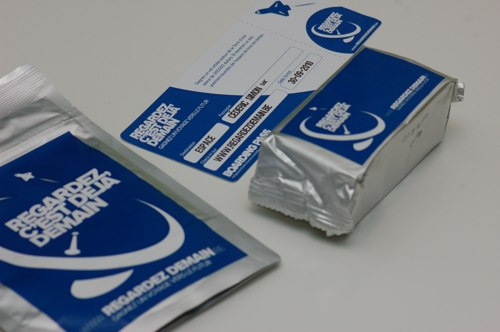
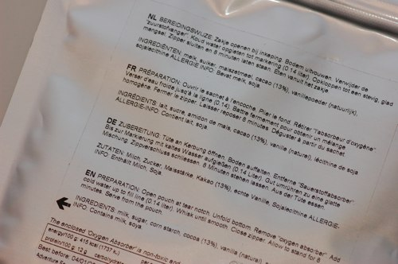
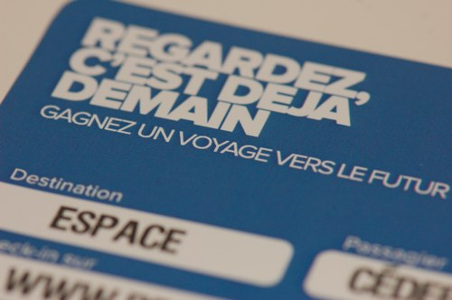

Truc de fou !

<!-- excerpt -->

Voila ce que nous venons de recevoir par le courrier: un petit colis avec une hypothétique carte d'embarquement pour un vol orbital autour de la Terre, un sachet de....heuuu... quelque chose qui se mange pourvu qu'on ajoute de l'eau, qu'on mélange et qu'on laisse reposer 8 minutes (et qu'on retire l'absorbeur d'oxygène, mais ça c'est une évidence!) et un paquet de biscuits.

Et derrière tout ça? La possibilité de gagner un vol orbital autour de la Terre, d'une valeur de 200 000 dollars. Devenir l'un des premiers touristes de l'espace. Whaaaaaah!

Du coup on n'a pas ouvert le sachet de machin lyophilisé. Au cas où.

Alors dans l'ordre:

- On va sur le site de [Regardez, c'est déjà demain](http://www.regardezdemain.be/)
- On imprime l'affiche promotionnelle ou on la trouve dans le journal
- On la met en évidence à une fenêtre en façade, pour que tout le monde la voie et pour que l'un des agents la repère
- On s'inscrit sur le site, on répond à quelques questions
- On multiplie ses chances de gagner en prenant une photo de l'affiche à la fenêtre, en prévenant ses proches, en twittant et en postant sur Facebook.

Fin septembre, l'un des participants gagnera sa carte d'embarquement pour un voyage spatial en apesanteur à 15000 m d'altitude organisé par une agence agréée. Youhouu!
