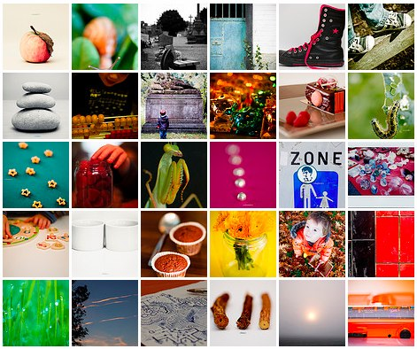

Je vous l'avais annoncé il y a un mois, [j'ai commencé un projet 365](http://64k.be/2010/09/18/un-defi-le-projet-365/). Pour rappel, l'idée est de prendre une photo chaque jour, pendant un an. J'avais envie de corser le jeu en pensant à un mot le matin et en tentant d'y faire correspondre une photo. Ca a bien fonctionné.... pendant un mois. Petit bémol. Il y a des jours où j'ai plein d'idées dans tous les sens et des jours où c'est le vide. Il y a des photos que j'aimerais parfois mettre en évidence alors qu'elles n'ont rien à voir avec mon mot du jour. Il y a des moments que j'ai envie de partager, qui représentent mon évènement du jour, ma belle lumière du jour, mon coup de coeur artistique du jour.... et que je dois laisser dans l'ombre de la photo du jour parce que j'ai décidé un mot le matin-même. Donc bref le mot du jour est une bonne idée mais sur le court terme. Genre un mois.

Puis j'avoue qu'il y a des jours où je n'ai vraiment pas que ça à penser. Boulot, maison, enfant.... comme tout le monde quoi.  "Mais une photo ça prend 1/60 de seconde, hop un peu sur Lightroom, hop sur Flickr, hop sur Facebook, 10 minutes au maximum" vous me direz. Oui sauf que non en fait. Je prends vraiment le projet à coeur et quand je n'ai pas d'idée de photo, ça m'obsède jusqu'à ce que cette ****** de photo soit faite. Et il y a des jours où vraiment, mais vraiment, avec la meilleure volonté du monde, je ne peux pas me permettre d'être obsédée par une photo.

<!-- excerpt -->

Les règles du jeu vont changer. Moins de prise de tête, plus de spontanéité.

Par contre, vous êtes beaucoup à vous intéresser au projet et à avoir joué le jeu. Beaucoup d'entre vous m'ont proposé des mots et je les ai tous notés. Un tout tout grand merci à vous! Chacun aura sa photo, je n'ai vraiment pas envie de laisser tomber l'idée des mots mais je saisirai les occasions au lieu de les provoquer.

En un mois j'ai appris une foule de choses, c'est une expérience déjà très positive. Il y a des photos que je n'aurais jamais prises si le mot du jour ne m'y avait pas amenée. Puis j'ai forcé toute la petite famille à sortir de la maison le w-e pour aller prendre des photos, on a tous trouvé ça beaucoup mieux que de rester en pyjama jusque pas d'heure. J'ai tenu compte de commentaires pour essayer de moins dépendre du flash, d'apprendre à me séparer de temps en temps de mon bien-aimé 105mm au profit du 50mm, de gérer différemment la profondeur de champ, de tester de nouveaux angles de vue, de tenter de me bousculer vis-à-vis de la règle des tiers, de changer un peu de mon sempiternel format paysage au profit du format portrait. J'ai enfin compris un tas de trucs hyper-trop techniques pour moi, je ne considère plus autant la photo comme étant à faire uniquement au feeling, je me cogne parfois à des réglages rien que pour éviter le flash, pour éviter une ombre trop moche, etc. etc. Bref, ma petite expérience de la photo est immensément (à mon échelle) enrichie, rien qu'en un mois. Bon il faut dire ce qui est aussi, au niveau technique: mon appareil c'est l'entrée de gamme. Un D50. Du bruit à 400 iso (ça résume bien je trouve) Je l'aime mais voila quoi. Mais je l'aime. Mais voila quoi.

Enfin je l'aime hein.

Mais je vais avoir un D7000 :D

Bientôt :D

Plus tôt que prévu. :D

Hihi.

Enfin voilà. Encore merci à ceux qui montrent leur intérêt en commentant les photos, en les regardant simplement, en "aimant ça" sur Facebook, en m'encourageant, en demandant des nouvelles, en y croyant, en s'inquiétant quand il n'y a pas encore eu de photo postée ;)

Plus que 11 mois!

[L'album sur Flickr](http://www.flickr.com/photos/64k/sets/72157624969729130/)
