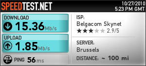

Il y a encore un an, je n'aurai jamais pensé écrire ce billet. Et pourtant on est connecté chez Belgacom depuis hier !

Rappelez-vous, en 2006, [on quittait l'opérateur historique](http://64k.be/2006/11/10/bye-bye-belgacom-adsl-on-passe-a-dommel/), son tarif élevé et ses quotas très limités pour le petit opérateur [Dommel](http://www.dommel.be). fin 2008, on avait même complètement abandonné la ligne fixe, pour [Dommel Homeconnect](http://64k.be/2009/01/04/dommel-homeconnect-fonctionne-enfin/). Cette fois on avait eu pas mal de soucis de communication avec nos amis flamands.

<!-- excerpt -->

Deux ans plus tard, rien n'avait changé chez Dommel. Leur produit Homeconnect arrive en fin de vie et il n'y a pas eu la moindre amélioration. On n'était encore en ADSL 4,6mb, pour un tarif devenu assez élevé de 50€ par mois, ceci comprenant tout de même les téléchargements et le téléphone fixe illimité.

J'ai découvert que le VDSL2 était enfin disponible chez nous. J'aurai pu rester chez Dommel, mais leur gros problème de communication avec les clients m'a vraiment refroidi. Et puis chez eux ni le modem (139 €), ni l'activation pour les clients actuels (99 €) ne sont gratuits. Auquel il faut encore ajouter les 13 € par mois si on ne veut pas de ligne fixe.

Bref, le modem et les 5 mois gratuits chez Belgacom ont fini par me convaincre. Pour ne pas changer, le transfert a été d'une extrême lenteur. J'ai commandé le 16 septembre sur leur site. Cette première commande a été annulée car ils l'avaient mise en ADSL. Deuxième commande et cette fois ils se trompent d'adresse. Dingue. Après au moins 20 coups de fils au helpdesk, on a enfin été activé hier. Je dois dire que c'est vraiment la galère si on veut du VDSL2 sans Belgacom TV. On dirait que les clients qui veulent la TV sont prioritaires.

On a choisi l'offre [Internet Favorite](http://www.belgacom.be/private/fr/jsp/dynamic/product.jsp?dcrName=hbs_adsl_res_go&amp;detailPage=inter_compare_tab) à 42,90€ par mois. Le quota est relativement confortable (100 Gb). Évidemment on habite toujours à la campagne et on a un profil 16,5 mb en download et 2 mbps en download. Quatre fois plus rapide que notre ancienne connexion, pour un tarif légèrement inférieur. A terme, je pense même héberger 64k à la maison.

On a perdu l'accès aux newsgroups, mais vu la pléthore d'offres disponibles, je devrais rapidement trouver mon bonheur.

Comme l'offre Homeconnect proposait le téléphone VoIP, j'ai dû choisir un remplaçant. Je me suis tourné vers [3StarsNet](http://www.3starsnet.com/). Pour seulement 20€ par an, on dispose d'un numéro de téléphone fixe. Les appels ne sont pas très chers, mais à terme je compte acheter un téléphone Siemens C470IP. Cela me permettra de passer par [Poivy](http://www.poivy.com) et son téléphone fixe grauit pour les appels sortants.

Nous voilà déjà un peu plus dans _l'Internet du futur_ ;-)

