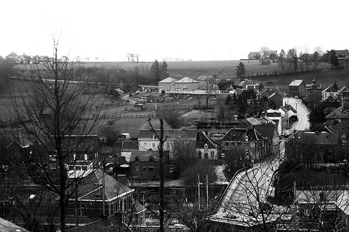

Avec les débuts d'Elliott à  l'école, j'ai pas mal de souvenir de ma propre enfance qui me reviennent  en tête. J'ai eu envie de commencer une nouvelle série qui s'étoffera  tout doucement, au fil des occasions.

La  route de l'école: Nous avions une bonne demi heure de route avant  d'arriver à l'école. Il me semble que je passais cette demi-heure à  lire. Je crois même me souvenir que je profitais de l'éclairage orange  des lampes de rue lorsqu'il faisait encore noir. Néanmoins je levais le  nez de mes livres lors de ce tronçon en particulier. Ca commençait en  haut à gauche de la photo. Il était possible de prendre un peu de  vitesse et descendre toute cette route comme si nous faisons la course.  La course se continuait par un saut périlleux, ou presque. J'en avais en  tout cas les sensations dans le ventre en passant à toute vitesse sur  le pont de la Sambre (en bas à droite de la photo). Après ces émotions  fortes, la voiture passait sous le pont de la gare et se transformait en  4X4 pour remonter toute la côte de Lobbes. Cette côte était en pavés,  elle était de très mauvaise qualité, des trous partout.

Tiens  en voyant la photo, une autre anecdote me revient en tête. Le pont  avait été en travaux pendant un bon moment et les automobilistes étaient  dirigés vers une passerelle verte. Impossible pour moi de retenir le  mot "passerelle", le premier mot qui me venait en tête, pendant  plusieurs mois (pour ne pas dire plusieurs année, pas sûre) était  "capitalesse". Allez comprendre...
