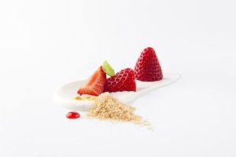
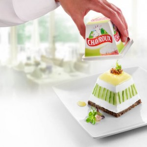

12 grands Chefs...
3 services...
Un peu de Chavroux...
... ça n'a pas de prix ^^

Et effectivement. Du 13 au 30 juin inclus, douze Chefs de haut vol répartis sur l'ensemble  du territoire belge proposeront un menu trois services en y intégrant  subtilement du Chavroux, le célèbre fromage de chèvre frais et  délicieusement onctueux. Pour élaborer leurs recettes, ils ont pu compter sur le soutien de professionnels de l’alimentation, qui ont scientifiquement  analysé la valeur gustative de Chavroux sur la base du principe du  foodpairing (harmonie moléculaire).
Il appartiendra alors aux convives de décider eux-mêmes  du montant qu'ils souhaiteront payer !

Les personnes désirant participer à l’action peuvent dés maintenant trouver la liste des restaurants et brasseries et réserver une table pour deux sur le site de [Chef Chavroux](http://www.chefchavroux.be/).

<!-- excerpt -->

Envie de cuisiner le Chavroux comme un grand chef? Le site propose également quelques appétissantes recettes...

&nbsp;
