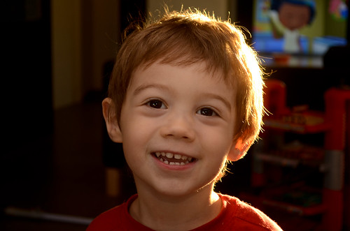

Alors soit les enfants ne sont pas si complexes que ça, soit notre loustic a déjà son orgueil de petit mec bien placé.

La semaine dernière, il a pleuré chaque matin, à gros sanglots, dans les bras de Madame Valérie qui l'arrachait des miens en disant "mais non, mon loulou, tu sais bien que l'école c'est pas pour les mamans"

<!-- excerpt -->

J'ai donc cherché la cause de ces pleurs. Le premier jour je me suis dit "Baaaah, on sort du congé de Toussaint, demain ça ira mieux". Le lendemain je me suis dit pareil. Le 3ème jour, j'étais (presque) dans le même état que lui. "Mais qu'est ce qu'il a? Y a un petit con qui s'est disputé avec lui? Il s'est fait disputer par son instit (à tort, évidemment huhu) ? Il y a un truc qui ne va pas, il est mal dans sa peau, il s'ennuie en classe, il est surdoué, il va devoir passer une ou deux classes, ou alors les autres sont trop rapides pour lui? Il lui faut des cours supplémentaires? Il n'a pas assez d'activités extra-scolaires?  Au secours, qu'est ce qu'il se passe.... " etc. etc. Non je ne suis pas une mère poule, où donc allez-vous chercher ça. Le dernier matin de la semaine dernière, il pleurait encore. Ainsi que ce lundi.

Nous avons donc eu une bonne conversation.
"Tu sais c'est comme Madame Valérie le dit, l'école c'est pas pour les mamans" "Mais si, y a la maman de machin qui est institutrice, toi t'es pas là". (okéééé)
"Mais pourquoi tu pleures au fait? Avant les congés tu pleurais pas, qu'est ce qu'il s'est passé?" "Mais j'aime paaaaas quand tu t'en vas"
"Madame m'a dit que tu pleures à peine 30 secondes et puis que c'est le grand sourire toute la journée" "Mais oui, mais j'aime paaaaaas quand tu t'en vaaaaas" (au moins c'est clair)
"Mais tu sais, je ne peux pas rester, y a plein de choses que je fais pour toi pendant la journée" "..."
Houla je tiens le bon bout, il sait pas quoi dire héhéhé vas-y ma vieille, attaque "Et comment tu veux que j'aille trouver St Nicolas pour lui dire les jouets qu'il doit t'apporter si je reste à l'école toute la journée avec toi?" (oui c'est petit, je sais). Réponse du loustic: "... ah oui!"

Hahaha, c'est qui la super maman qui trouve des super arguments? C'est moiiiii.

Le mardi, pas de larme. Je lui dis que c'est génial et son instit enchérit en disant "c'est très bien, mon loulou, c'est comme on a dit" (hein? qui? quoi? qu'est ce qu'elle lui a dit? c'est MOI qui ai réglé le problème!)
Mercredi, pas de larme.
Ce matin, pas une seule larme non plus. Donc je le félicite, "Dis donc c'est bien, tu ne pleures plus, je suis contente!"

Et là, la réponse d'Elliott "Oui, Aurélien, il m'a dit que c'est les bébés qui pleurent et qui vont dans les bras de Madame Valérie, alors moi je pleure pas parce que je suis pas un bébé"

Voilà ce qui arrive quand on veut être diplomate, on se fait doubler par un petit blanc-bec de 3 ans.

